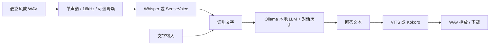

# 本地语音交互实验室

新声音已接入 **GPT-SoVITS v4 + 纳西妲 RVC**。从 GitHub 在新电脑安装请先看 [GPT-SoVITS v4 安装教程](docs/install-gpt-sovits.md)；已有本机配置的使用方法、试听与启动命令见 [新语音说明](docs/voice-upgrade.md)。新网页端口为 `8502`，配置为 `config.voice-upgrade.toml`。下文的 `config.local.toml` 保留用于原始 Whisper/SenseVoice、VITS/Kokoro 试验。

仓库只保存代码、配置模板和文档，不包含大型模型、GPT-SoVITS 运行包、RVC 权重、个人录音或实验输出。这些文件被 `.gitignore` 排除，按下文说明在目标电脑上准备。当前升级配置模板见 `config.voice-upgrade.example.toml`；复制为 `config.voice-upgrade.toml` 后填写参考音频和实际模型路径。

把老师的任务落实成一个可以逐步完成的原型：**录音 → ASR 转文字 → 本地 LLM 回答 → TTS 生成语音 → 播放**，并提供模型对比和噪声实验工具。

2026-09-16 更新：已准备录音试验数据、下载两种 ASR 与两种 TTS 权重，并完成真实模型的初步实验。当前本机运行请使用 `config.local.toml`。录音整理、结果和启动方法见 [录音工作流](docs/recording-workflow.md)，实验结果见 [试验报告](outputs/pilot/report.md)。本人已确认文件名与实际说话内容一致；noise1 是日常环境底噪，noise2 是房间开窗时的噪声。样本量仍不足以作为最终评测。早期自动测试记录见 [验证记录](docs/verification.md)。

## 1. 老师具体让你做什么

你需要完成三件事：

1. **搭系统**：把现成的开源模型接起来，用户说一句话，模型用语音回答。通常不需要自己训练模型。
2. **做选型实验**：选至少两个 ASR、两个 TTS，用同一批数据测试，说明准确率、速度、资源消耗和部署难度的差异。
3. **研究抗噪声**：录制干净语音和环境噪声，比较不降噪与降噪后 ASR 的表现，解释哪些场景改善、哪些没有改善。

ASR 是语音识别，TTS 是语音合成，LLM 是语言模型。VLM 额外处理图像；只做语音聊天时可以先用 LLM，不必加入摄像头。两周的目标是原型和初步实验，不是从零训练模型或保证任何噪声条件下都能稳定识别。

## 2. 第一版的结构



- 浏览器界面使用 Streamlit，提供录音、WAV 上传、文字输入、模型选择、降噪开关和耗时显示。
- ASR、LLM、TTS 分别封装；替换某个模型时不用重写整个应用。
- ASR 按需加载并缓存。Whisper 内置 VAD 用来减少无语音片段；VAD 本身不是降噪。
- LLM 默认通过 `http://127.0.0.1:11434/api/chat` 访问本机 Ollama。配置为远程地址时，识别文字和对话历史会发送到该地址。
- TTS 在本机通过 sherpa-onnx 运行 VITS 或 Kokoro。它们是两种模型；sherpa-onnx 是推理工具。
- 频谱降噪使用 noisereduce 的非平稳谱门控；另有 80Hz 高通滤波作为简单基线。
- 当前按整段录音处理，最长 60 秒；暂未实现流式识别、边生成边播报、打断和回声消除。

## 3. Windows 安装与启动

建议 Python 3.11 或 3.12。所有命令在项目根目录的 PowerShell 中运行。

把项目复制到另一台 Windows 电脑时，不要复制旧电脑的 `.venv`；虚拟环境包含旧电脑的绝对路径和平台相关文件。复制整个项目目录（尤其是 `models/`、`vitsModel/`、`rvc/`、`vendor/` 以及你自己的 `config.local.toml` / `config.voice-upgrade.toml`），然后在新电脑项目根目录运行：

```powershell
.\setup_new_computer.ps1
```

这个脚本会创建新的 `.venv` 并安装项目依赖。启动时运行 `.\start_voice_lab.ps1`：如果 GPT-SoVITS 整合包完整存在，会使用升级配置；否则自动回退到 `config.local.toml`，再否则使用随项目提供的 `config.toml`。模型权重不会通过 pip 安装，必须一起复制或按下文重新下载。

### 3.1 安装依赖

```powershell
python -m venv .venv
.\.venv\Scripts\python.exe -m pip install --upgrade pip
.\.venv\Scripts\python.exe -m pip install -e ".[whisper,tts,denoise,dev]"
```

如果本目录已有 `.venv`，跳过创建步骤即可。无需激活环境，直接调用环境内 Python，也无需修改 PowerShell 执行策略。如果用 `uv` 创建的环境没有 pip，可用：

```powershell
uv pip install --python .venv/Scripts/python.exe -e ".[whisper,tts,denoise,dev]"
```

若 PyPI 下载缓慢，可在安装命令中加 `--index-url https://pypi.tuna.tsinghua.edu.cn/simple` 使用清华镜像。镜像可能有同步延迟，最终安装版本以本地记录为准。

SenseVoice 是第二阶段可选依赖，建议在另一虚拟环境安装，避免 PyTorch / torchaudio 版本影响已跑通的基线：

```powershell
python -m venv .venv-sensevoice
.\.venv-sensevoice\Scripts\python.exe -m pip install -e ".[sensevoice,tts,denoise,dev]"
```

### 3.2 准备本地 LLM

从 [Ollama 官网](https://ollama.com/download/windows) 安装 Windows 版本，然后：

```powershell
ollama pull qwen2.5:3b
ollama list
```

Ollama 桌面应用通常会启动本地服务；未启动时在另一终端执行 `ollama serve`。如果显示端口已被占用，检查是不是已有 Ollama 服务。

默认选择较小的中文模型，便于先验证流程。后续可以换成你已经下载的模型，同时修改 `config.toml` 的 `[llm].model`。

### 3.3 准备中文 TTS 权重

默认 VITS 模型约 30 MiB，来自 sherpa-onnx 官方发布页：

```powershell
New-Item -ItemType Directory -Force models
curl.exe -fL --retry 3 https://github.com/k2-fsa/sherpa-onnx/releases/download/tts-models/vits-icefall-zh-aishell3.tar.bz2 -o models/vits-icefall-zh-aishell3.tar.bz2
tar -xjf models/vits-icefall-zh-aishell3.tar.bz2 -C models
```

确认 `models/vits-icefall-zh-aishell3/` 下存在 `model.onnx`、`tokens.txt`、`lexicon.txt`、`phone.fst`、`date.fst`、`number.fst`。默认配置已指向这些文件；FST 规则帮助处理数字、日期和电话号码。

第二个 TTS 选项为多语言 Kokoro v1.1，压缩包约 348 MiB。需要比较时再下载：

```powershell
curl.exe -fL --retry 3 https://github.com/k2-fsa/sherpa-onnx/releases/download/tts-models/kokoro-multi-lang-v1_1.tar.bz2 -o models/kokoro-multi-lang-v1_1.tar.bz2
tar -xjf models/kokoro-multi-lang-v1_1.tar.bz2 -C models
```

页面中选择 `kokoro`。配置包含中文和英文词典；音色编号应按该版本的官方音色列表选择中文音色，不同版本的编号不能默认通用。核对解压后的文件名，如与配置不一致需调整 `[tts.kokoro]`。不要误用仅支持英文的 Kokoro 包。

### 3.4 准备 ASR 并运行

Whisper 默认使用 `small`，首次识别会下载对应权重，需要联网和额外磁盘空间；后续使用本地缓存。也可以预先下载兼容 faster-whisper 的 CTranslate2 模型，在 `[asr].whisper_model` 中填写本地目录。SenseVoice 同样需要首次下载 `iic/SenseVoiceSmall`，或改为本地模型目录。

```powershell
.\.venv\Scripts\python.exe -m voice_lab.doctor --probe-ollama
.\.venv\Scripts\python.exe -m streamlit run app.py --server.address 127.0.0.1
```

打开终端显示的 `http://localhost:8501`。允许麦克风权限，录一段中文，点击结束录音，再点击“发送并生成语音”。浏览器如果没有自动播放，点击播放器即可。

建议按这个顺序排查：**先用文字输入验证 LLM + TTS，再用 WAV 验证 ASR，最后测试麦克风。** `doctor` 只检查依赖与文件是否存在；它不会下载权重，也不会运行真实推理。

本机检测到 RTX 5080 / 约 16GB 显存。第一版 ASR 和 TTS 默认 CPU，减少初始部署的 CUDA 依赖；Ollama 会按自己的配置使用硬件。后续给 Whisper 设置 `device = "cuda"`、`compute_type = "float16"`，SenseVoice 设置 `device = "cuda:0"`。50 系显卡需要适配的推理库、驱动与 CUDA，不能只凭显存大小认定某个安装包可用。

需要保留自己的配置时：

```powershell
Copy-Item config.toml config.local.toml
$env:VOICE_LAB_CONFIG = "config.local.toml"
.\.venv\Scripts\python.exe -m streamlit run app.py --server.address 127.0.0.1
```

网页使用该环境变量；实验工具和 `doctor` 用 `--config config.local.toml` 指定。模型文件路径相对配置文件解析。实验报告会记录实际配置和依赖版本。

## 4. 模型选择：先作为候选，之后用实验下结论

| 环节 | 候选 | 选择理由 | 重点验证 |
| --- | --- | --- | --- |
| ASR | Whisper small / faster-whisper | 多语言生态成熟，可选择多种模型尺寸和量化方式 | 中文准确率、噪声幻觉、CPU/GPU 延迟 |
| ASR | SenseVoiceSmall / FunASR | 面向中文等多语言语音任务，适合进行中文选型比较 | 专有名词、中英混读、部署依赖、耗时 |
| TTS | VITS / icefall AISHELL-3 | 较小的中文 ONNX 模型，便于搭建基线 | 自然度、数字读法、多音字、CPU 速度 |
| TTS | Kokoro 多语言 v1.1 / sherpa-onnx | 支持多语言和多音色，适合作为第二候选 | 中文音色、中英混读、自然度、资源占用 |

表格是选型动机，不是本机测试结果。后续可探索更重的 CosyVoice 等模型；两周先完成两组可重复的比较。代码开源不代表所有模型权重使用相同许可证，最终报告应记录实际下载版本、来源和模型卡许可。

## 5. 做 ASR 与抗噪声实验

先录制 30–50 条干净中文语音，每条 3–10 秒，覆盖日常对话、数字、专有名词和少量中英混读。把 WAV 放进 `data/recordings/`，复制 `data/manifest.example.csv` 为 `data/manifest.csv` 并填写真实文本。示例中的 WAV **不附带**，不要直接当测试数据运行。

CSV 的 `path` 相对 CSV 所在目录；`condition` 标识干净、噪声类型等条件。参考文本需人工校对，不应直接用被测 ASR 的输出充当答案。

```powershell
.\.venv\Scripts\python.exe -m voice_lab.experiments asr --manifest data/manifest.csv --backend whisper --denoise off highpass spectral --output outputs/whisper.csv
```

使用 SenseVoice 所在环境运行同一清单：

```powershell
.\.venv-sensevoice\Scripts\python.exe -m voice_lab.experiments asr --manifest data/manifest.csv --backend sensevoice --denoise off highpass spectral --output outputs/sensevoice.csv
```

输出包含逐条识别文本、字符错误率 CER、预处理耗时、ASR 推理耗时、实时率 RTF，以及 JSON 汇总。**CER 越低越好；RTF = 推理耗时 / 录音时长，越低越快。** CER 可以超过 100%，例如模型插入了很多不存在的字。汇总按参考文本总字数计算，而不是简单平均每条 CER。

中文 CER 会忽略空白和标点，统一大小写与全半角，但不会把“123”自动转换成“一百二十三”；数字规范化差异应在报告中说明。加载、首次下载、一次预热不计入推理 RTF，加载耗时另外保存。Whisper 默认包含 VAD、SenseVoice 当前适配器没有 VAD，因此这里比较的是这两套推理配置的整体效果。

录一段没有目标说话人的风扇声或环境声，例如 `data/recordings/fan.wav`，混成不同信噪比的数据集：

```powershell
.\.venv\Scripts\python.exe -m voice_lab.experiments mix-noise --manifest data/manifest.csv --noise data/recordings/fan.wav --snr 20 10 0 --output outputs/fan
.\.venv\Scripts\python.exe -m voice_lab.experiments asr --manifest outputs/fan/manifest.csv --backend whisper --denoise off highpass spectral --output outputs/whisper_fan.csv
```

SNR 越小，噪声相对越强。混音按整段 RMS 定义信噪比，噪声不足会从开头循环，混合后统一缩放以避免削波；因此它是可复现的初步实验，不能代替真实嘈杂环境录音。建议再加入键盘声、街道声和背景人声，并至少测一组真实现场录音。

高通滤波主要处理低频轰鸣；谱门控可能减弱某些背景噪声，也可能损伤语音。**只有相同测试集上 CER 下降，才能说该方案改善了识别。** 对背景说话声，后续可探索 RNNoise、DeepFilterNet 或语音分离模型；它们尚未接入本项目。

## 6. 做 TTS 实验

`data/tts_texts.txt` 每行是一条固定测试文本。下载相应模型后分别生成：

```powershell
.\.venv\Scripts\python.exe -m voice_lab.experiments tts --backend vits --output outputs/tts_vits
.\.venv\Scripts\python.exe -m voice_lab.experiments tts --backend kokoro --output outputs/tts_kokoro
```

选音色可通过修改配置并加 `--config`；网页中的临时选项不会修改配置文件。输出为真实合成的 WAV、逐条耗时 / RTF、环境信息。每次实验先预热一次，加载耗时单独记录。

两种模型用相同文本、相近语速，在相同设备运行。随机化样音顺序，请 3–5 位同学独立按 1–5 分评价自然度、清晰度，并记录漏字、数字、多音字和英文读音问题。这属于小样本主观听评，不应包装成严格标准化的 MOS 结论。显存、内存、模型大小和冷启动时间也应记录；当前脚本不会自动采样内存或显存。

## 7. 开发与交付

```powershell
.\.venv\Scripts\python.exe -m pytest -q
.\.venv\Scripts\python.exe -m voice_lab.experiments --help
```

| 文件 | 用途 |
| --- | --- |
| `app.py` | 交互网页 |
| `config.toml` | 模型、路径和默认参数 |
| `voice_lab/audio.py` | 音频转换、降噪、指定 SNR 混音 |
| `voice_lab/backends.py` | 两种 ASR、Ollama、两种 TTS 的适配器 |
| `voice_lab/pipeline.py` | 对话流程、耗时、错误处理 |
| `voice_lab/experiments.py` | ASR / TTS / 噪声实验命令 |
| `voice_lab/doctor.py` | 依赖、模型文件和服务检查 |
| `docs/two-week-plan.md` | 每日计划、交付物和报告模板 |

默认网页音频与对话只保存在运行会话中，不主动写入录音文件。实验命令会按要求把音频、转写和结果写进 `outputs/`。第一版只建议在本机运行，尚未设计多用户部署。

参考：

- [faster-whisper](https://github.com/SYSTRAN/faster-whisper)
- [SenseVoice](https://github.com/FunAudioLLM/SenseVoice) / [FunASR](https://github.com/modelscope/FunASR)
- [sherpa-onnx TTS 文档](https://k2-fsa.github.io/sherpa/onnx/tts/index.html) / [模型发布页](https://github.com/k2-fsa/sherpa-onnx/releases/tag/tts-models)
- [sherpa-onnx Python 示例](https://github.com/k2-fsa/sherpa-onnx/blob/master/python-api-examples/offline-tts.py)
- [noisereduce](https://github.com/timsainb/noisereduce)
- [Ollama](https://github.com/ollama/ollama)
